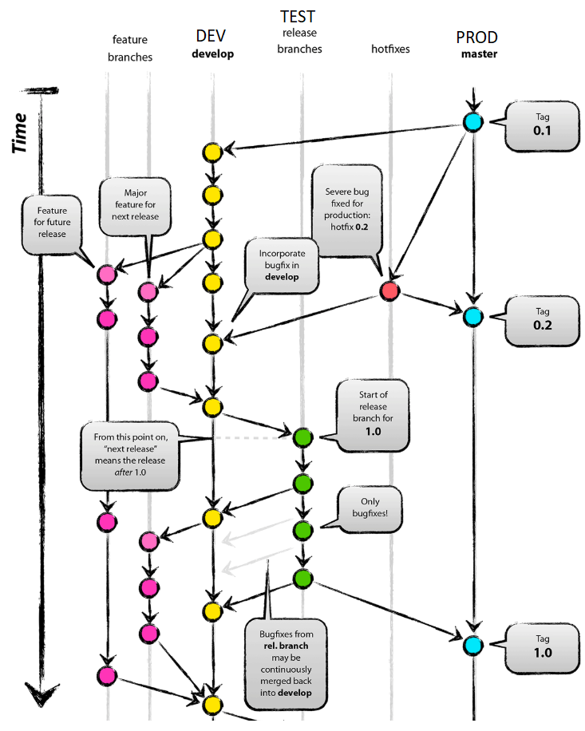
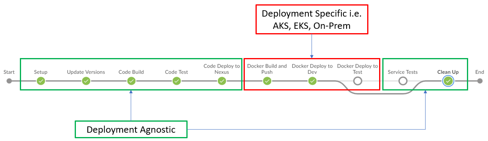

# Development & Automated Deployment Strategy

## Table of Contents
+ **[Overview](#overview)**
  + [Versioning Strategy](#versioning-strategy)
  + [Creating a Git Repository](#creating-a-git-repository)
+ **[Development Strategy](#development-strategy)**
  + [Branch Overview](#branch-overview)
  + [Develop Branch](#develop-branch)
  + [Master Branch](#master-branch)
  + [Feature Branch](#feature-branch)
  + [Release Branch](#release-branch)
  + [Hotfix Branch](#hotfix-branch)
+ **[Automated Deployment Strategy](#automated-deployment-strategy)**
  + [Continuous Integration](#continuous-integration)
  + [Continuous Deployment](#continuous-deployment)
  + [Continuous Delivery](#continuous-delivery)
+ **[How Do I...](#how-do-i)**
  + [Start a new Feature](#start-a-new-feature)
  + [Complete a Feature](#complete-a-feature)
  + [Start a new TEST Release](#start-a-new-test-release)
  + [Complete a TEST Release](#complete-a-test-release)
  + [Start a new PROD Release](#start-a-new-prod-release)
  + [Complete a PROD Release](#complete-a-prod-release)
  + [Start a new Hotfix](#start-a-new-hotfix)
  + [Complete a Hotfix](#complete-a-hotfix)
+ **[Helpful Links](#helpful-links)**
  + [Git](#git)
  + [Jenkins](#jenkins)

## Overview

The aim of the following document is to provide detailed information that explains the development and automated deployment strategy for the IPIM-IP platform.

The document is split into two main parts, the Development Strategy and the Automated Deployment Strategy.

The Development Strategy details how the team should use Git in order to use the full capabilities of the platform whereas the Automated Deployment Strategy explains how various tools are used to aid the development and deployment of new functionality.

The Git strategy being used is derived from Git Flow, the [Git Flow](https://nvie.com/posts/a-successful-git-branching-model/) model is considered one of, if not **the** most widely adopted git branching model.

</img>

Whilst the overall process is mainly automated there are still manual checkpoints in order to allow Code Reviews/Inspections so no services are deployed all the way to Production without any human interaction.

### Target Audience
This document is aimed at Developers and Team Leaders, regardless of their experience level although a basic understanding of Git and Git Branches is recommended but not mandatory.

### Versioning Strategy

The versioning approach used in the platform is based on [Semantic Versioning](https://semver.org/), the version of a component is declared as MAJOR.MINOR.PATCH with each section being defined as follows:

+ MAJOR: This value is incremented when the component contains new functionality or bug-fixes that **are not** backward compatible
+ MINOR: This value is incremented when the component contains new functionality or bug-fixes that **are** backward compatible
+ PATCH: This value is only incremented when the component requires a hotfix

The above definition differs slightly to the specification defined by [Semantic Versioning](https://semver.org/), the reason for the difference is to allow the Automated Deployment Strategy to remain effective when components require a hotfix, this is detailed further below in the [Hotfix Branch](#hotfix-branch) section.

### Creating a Git Repository

TODO - Project Onboarding - How to create a new repo

What happens if repo already exists??

## Development Strategy

Each git repository should contain **one** component that should be deployed via the CI/CD pipeline along with one corresponding Dockerfile that will be used to build a deployable image. *Note: docker-compose is **not** supported.*

The repository will contain two main branches `develop` and `master`, these branches are fixed and cannot be removed, the branches will also be protected so that developers are unable to directly commit into them, don't panic, this prevention of direct committing provides the opportunity for manual process checks to prevent the component being deployed without it meeting the developers requirements.

In order to commit code into these two branches, the developer needs to use a pull request; when the pull request is opened, it will automatically fire off a special CI/CD pipeline that executes the unit tests and will report back the status of the unit tests directly into the pull request, if the unit tests fail then the pull request **cannot** be merged and an update to the component will be required.

At a high level, the `develop` branch will be used when the component is ready to be deployed to the DEV environment whereas the `master` branch will be used when the component is ready to be deployed to the PROD environment.

To accompany the two main branches, there will be three extra branching folders which together will make up the git process:
+ Feature branch naming convention:- `feature/<DESCRIPTIVE NAME OF CHANGE>` e.g. `feature/BUG-2871` or `feature/add-logging`
+ Release branch naming convention:- `release/<RELEASE VERSION>` e.g. `release/1.0.0`
+ Hotfix branch naming convention:-  `hotfix/<INCIDENT ID/PATCH NUMBER>` e.g. `hotfix/JIRA-12`

If the `develop` branch is secured then developers might be wondering how do they deploy the component to DEV, this is where the `feature` branches come in, each new piece of work should be contained in it's own feature branch, the feature branches allow developers to sandbox their changes until they have tested the changes locally. When a developer is confident that they have tested their component locally then they are able to raise a pull request from their feature branch into the develop branch, this pull request is the first manual check.

Assuming the pull request checks all pass, developers can merge the pull request into the `develop` branch, when the pull request is merged the CI/CD pipeline will detect that the `develop` branch now contains an updated version of the component, this will automatically build the component, execute unit tests, deploy the component to Nexus and then trigger a docker build followed by a deployment to the DEV environment. Any bug fixes for the version in DEV must be completed in the corresponding feature branch and then merged into the `develop` branch.

Upon the component being deemed ready to progress from DEV, the developer should create a new branch from the `develop` branch, the name of the new branch should follow the release naming convention described above. The name of this branch is important as this will be used by the CI/CD pipeline to version the component, for example in a Java application the pom.xml file will be updated to include the version from the branch name i.e. `release/1.1.0` would translate to a version of `1.1.0`. When the branch is created it will automatically execute a CI/CD pipeline and will deploy the newly versioned component into the designated TEST environment, the last step of this pipeline is the service tests which includes Dredd, API Fortress and a designated performance benchmark tool. From this point forward, any bug fixes should be made directly into the release branch and **not** in the feature branch! Any bug fix that is performed in the release branch will automatically execute the CI/CD pipeline thus deploying the bug fixes immediately into the TEST environment.

Once the component is ready to be released to PROD, the developer must raise a new pull request from the release branch into the `master` branch, this is the second and final manual checkpoint, in order for the pull request to be merged, the changes must be reviewed and approved by at least one other member of the development team and/or a designated release manager. Again the pull request being opened will trigger a specific CI/CD pipeline that executes the unit tests, just to ensure code hasn't been introduced that isn't covered by tests, this pull request from `release/` into `master` will also deploy the component to the PPE environment if the PPE region has been specified in the `deployment.properties` file. **TODO - When the pull request is raised, a new pull request will be opened automatically from the release branch to the `develop` branch, this is to ensure that the bug fixes implemented in the release branch are pushed back into the `develop` branch so that bugs don't re-appear.**

When the pull request has been approved and all of the checks pass, it can be merged, doing so will trigger a new CI/CD pipeline that runs against the `master` branch, this takes the version of the component from the release branch, retrieves it from Docker and then deploys it into the PROD environment before executing the same set of service tests as previously done in the TEST environment. The service tests are a key indicator to ensure that the deployment was successful and the component hasn't changed drastically between environments.

In a perfect world, the component would never break and would never require an urgent fix, however, in the real world this does happen. To cater for this scenario the hotfix branches can be used, they should only be used for **urgent** P1 incidents, to create a new hotfix deployment, the developer should create a branch from `master` and follow the hotfix naming convention, i.e. `hotfix/JIRA-12`, the hotfix branch will **not** fire off any CI/CD pipelines until a pull request is made from the hotfix branch to `master`, as mentioned above the pull request executes the unit tests for the component thus ensuring the new bugfix/change has been tested properly. The pull request will require the same checks as `release->master` does and cannot be merged until all checks have passed. When the pull request is merged, it will execute the normal `master` pipeline to deploy the component to PROD. *Note: The pull request from `hotfix/` to `master` will **not** deploy the component to PPE*

At the point of raising the `hotfix -> master` pull request, the developer should raise a pull request to the `develop` branch so that the fix is incorporated into the `develop` branch to ensure it doesn't re-appear, the only difference to this rule is that if a release branch is currently active, then the hotfix should merge into release as opposed to develop so that when the component is promoted from TEST, the bug isn't re-introduced.

The following sections details what steps are executed along with any security/expectations each branch has, the branch sections can be see as quick references in order to get specific information for a designated branch i.e. naming conventions, what environment it relates too, if it has security etc.

### Branch Overview

|Branch|Naming Convention|Environment|What to Commit|How to Commit|
|------|-----------------|-----------|--------------|-------------|
|feature|feature/[NEW WORK] e.g. `feature/add-logs`|LOCAL|Local development for Bug Fixes Local development for New Functionality.|Direct Commit|
|develop|develop[ment]|DEV|Component after local testing complete. Bug Fixes from Release/HotFix branches.|Pull Request|
|release|release/[VERSION] e.g. `release/1.1.0`|TEST|Component ready for TEST release. Bug fixes for current TEST release.|Direct Commit|
|master|master|PROD|Component ready for PROD release. Confirmed fix for Urgent P1.|Pull Request|
|hotfix|hotfix/[P1 ISSUE] e.g. `hotfix/JIRA-12`|N/A|Urgent P1 Fix ??Patch for PROD??|Direct Commit|

### Feature Branch

|Branch|Naming Convention|Environment|What to Commit|How to Commit|
|------|-----------------|-----------|--------------|-------------|
|feature|feature/[NEW WORK] e.g. `feature/add-logs`|LOCAL|Local development for Bug Fixes Local development for New Functionality.|Direct Commit|

The `feature/` branches do not form part of the main branches, as such the `feature/` branches won't exist by default. The branches should all be created with a prefix of `feature/` and suffixed with a relevant name, for example if developers are working on adding logging capability to the component then the branch could be called `feature/add-logging`. The `feature/` branches allow direct commits and are unprotected, in order to progress the component to the DEV environment a Pull Request needs to be raised from the original `feature/` branch into the `develop` branch.

#### What/When should I commit?

New functionality and/or bug fixes should be committed into the `feature/` branch, this branch is only used for LOCAL testing and should remain in the feature branch until LOCAL testing is 100% complete.

#### Where do I make a bug fix?

A bug fix can be made directly in the `feature/` branches.

#### What about bug fixes in Release/Hotfix branches?

Bug fixes made in `release/` and `hotfix/` branches will be merged back into `develop`, as such the fixes don't need to be merged into the `feature/` branches because they will already be present in the `develop` branch.

If the bug fixes are urgently required in the `feature/` branches then the developer can manually make the bug fixes in their corresponding `feature/` branches.

#### What happens when I commit?

N/A - The CI/CD process is **not** used for any of the feature branches as they are for LOCAL testing only.

#### How do I promote to the next environment? (DEV)

In order to promote the component the developer should open a new pull request from a specific `feature/` branch into the `develop` branch, the new pull request will trigger automated unit tests to ensure the code in the `feature/` branch cannot be promoted unless it meets the testing requirements.

### Develop Branch

|Branch|Naming Convention|Environment|What to Commit|How to Commit|
|------|-----------------|-----------|--------------|-------------|
|develop|develop[ment]|DEV|Component after local testing complete. Bug Fixes from Release/HotFix branches.|Pull Request|

The `develop` branch is one of the two main branches and as such it should exist by default when the repository is created, the branch is protected which means that developers are **not** allowed to directly commit to it therefore they have to raise a pull request into `develop` in order to commit the latest bug fixes and/or functionality.

#### What/When should I commit?

The component should only be committed to the `develop` branch when LOCAL testing has completed, the component being merged into the DEV branch is the first chance to test the component with other components that it integrates with, as such defects might arise that were not present in the LOCAL testing, in order to commit the latest bug-fixes into the `develop` branch, developers are required to commit the fixes into the original `feature/` branch and raise a Pull Request into `develop`, this is because direct commits into `develop` are prohibited.

#### Where do I make a bug fix?

If a bug fix occurs when a component is tested in DEV, **before** it is released to TEST then the bug fix **must** be applied in the original feature branch and a new pull request be raised to the `develop` branch. If the component has been promoted to TEST and a bug is identified then the bug is fixed directly in the `release/` branch, this is covered further in the [Release Branch](#release-branch) section below.

#### What about bug fixes in Release/Hotfix branches?

When bug fixes have been made in the `release/` or `hotfix/` branches, the bug fixes **must** be merged back into the `develop` branch so that the issue doesn't re-occur when the component is next sent for release, in order to manage this effectively, when the developer raises a pull request from the [`hotfix/` / active `release/`] branch in to `master`, the CI/CD pipeline will raise a second pull request into the [`develop` / active `release/`] branch, by raising them at the same time it is ensuring that no bug fixes are overwritten/ignored and that the fixes will always be present in the [`develop` / active `release/`] branch. *Note: Merging the pull request from `release/` or `hotfix/` branches into the [`develop` / active `release/`] branch will likely cause merge conflicts, this is unavoidable and should be anticipated.*

#### What happens when I commit?

The `develop` branch is monitored by the Jenkins CI/CD platform, as such when the component is merged into the branch it will automatically trigger the pipeline, when this pipeline runs it will execute the following steps:
+ Increment Snapshot Version
+ Maven Install
+ Maven Test (Inc SonarQube integration)
+ Deploy to Nexus
+ Docker Build & Push
+ Deploy to DEV regions specified in `deployment.properties` file

This is explained in further detail in the below section [Automated Deployment Strategy](#automated-deployment-strategy).

#### How do I promote to the next environment? (TEST)

In order to promote the component the developer should create a new branch from the `develop` branch with a prefix of `release/`, this will trigger a new CI/CD pipeline that will deploy the component into TEST and execute automated functional tests, this is explained in further detail in the below section [Continuous Deployment](#continuous-deployment).

### Release Branch

|Branch|Naming Convention|Environment|What to Commit|How to Commit|
|------|-----------------|-----------|--------------|-------------|
|release|release/[VERSION] e.g. `release/1.1.0`|TEST|Component ready for TEST release. Bug fixes for current TEST release.|Direct Commit|

The `release/` branches do not form part of the main branches, as such the `release/` branches won't exist by default. The branches should all be created with a prefix of `release/` and suffixed with a specific version number, for example if developers are releasing version 1.1 then the branch should be called `release/1.1.0` *Note: The version number **cannot** increment the PATCH segment, it is only allowed to increment the MAJOR or MINOR segment e.g. `1.1.0`, `1.2.0` as opposed to `1.1.0`, `1.1.1` - This is due to the hotfix branches reserving the PATCH segment.*

The `release/` branches allow direct commits and are unprotected, each commit will automatically trigger a re-deployment to the TEST environment.

#### What/When should I commit?

The component should only be committed to the `release/` branches when DEV testing has completed, the component being deployed into the TEST environment is the first chance to test the component with the automated functional tests and also where customer testing could take place, as such defects might arise that were not present in the DEV testing, in order to commit the latest bug-fixes into the `release/` branches developers can directly commit into the branches, this is in order to increase the speed of delivery and progress the component through TEST quicker.

#### Where do I make a bug fix?

A bug fix can be made directly in the `release/` branches.

#### What about bug fixes in the Release/Hotfix branches?

When bug fixes have been made in the `hotfix/` branches, the bug fixes **must** be merged back into the `release/` branches if one is currently in progress, if the component is not currently in the TEST environment then the `hotfix/` fixes should be merged directly into `develop`, however, if the component **is** currently in the TEST environment then the fixes should be merged into the active `release/` branch so that the issue doesn't re-occur when the component is next sent for release, in order to manage this effectively, when the developer raises a pull request from the `hotfix/` branch in to `master`, the CI/CD pipeline will raise a second pull request into the [`develop` / active `release/`] branch, by raising them at the same time it is ensuring that no bug fixes are overwritten/ignored and that the fixes will always be present in the [`develop` / active `release/`] branch. *Note: Merging the pull request from `release/` or `hotfix/` into the [`develop` / active `release/`] branch will likely cause merge conflicts, this is unavoidable and should be anticipated.*

#### What happens when I commit?

The `release/` branches are monitored by the Jenkins CI/CD platform, as such when the branch is created or bug-fixes applied it will automatically trigger the pipeline, when this pipeline runs it will execute the following steps:
+ Version the component based on the branch name i.e. `release/1.1.0` would be version `1.1.0`
+ Maven Install
+ Maven Test (Inc SonarQube integration)
+ Deploy to Nexus
+ Docker Build & Push
+ Deploy to TEST regions specified in `deployment.properties` file

This is explained in further detail in the below section [Automated Deployment Strategy](#automated-deployment-strategy).

#### How do I promote to the next environment? (PROD)

In order to promote the component the developer should open a new pull request from the active `release/` branch into the `master` branch, the new pull request will trigger automated unit tests to ensure the code in the `release/` branch cannot be promoted unless it meets the testing requirements.

**TODO** *When the pull request is opened to the `master` branch, the pipeline will automatically create a pull request into the `develop` branch, this is to ensure that bug-fixes made in the current `release/` branch are not re-introduced the next time the component is released.*

### Master Branch

|Branch|Naming Convention|Environment|What to Commit|How to Commit|
|------|-----------------|-----------|--------------|-------------|
|master|master|PROD|Component ready for PROD release. Confirmed fix for Urgent P1.|Pull Request|

The `master` branch is one of the two main branches and as such it should exist by default when the repository is created, the branch is protected which means that developers are **not** allowed to directly commit to it therefore they have to raise a pull request into `master` in order to commit the component that is ready for PROD release.

#### What/When should I commit?

The component should only be committed to the `master` branch when ALL testing has completed **or** when developers have developed and tested a fig for an urgent issue.

#### Where do I make a bug fix?

In order to commit the latest bug-fixes into the `master` branch, developers have two options, if the defect is a high priority and requires an urgent fix then they can create a `hotfix/` branch in order to apply the change and raise a Pull Request into `master` **OR** if the defect is **not** a high priority then they can add the fix into the active `release/` branch or as part of the latest `feature/` branch.

#### What about bug fixes in Release/Hotfix branches?

When bug fixes have been made in the `hotfix/` branches, the bug fixes **must** be merged back into the `master` branch so that the issue is resolved in PROD, in order to manage this effectively, when the developer raises a pull request from the `hotfix/` branch in to `master`, the CI/CD pipeline will raise a second pull request into the [`develop` / active `release/`] branch, by raising them at the same time it is ensuring that no bug fixes are overwritten/ignored and that the fixes will always be present in the [`develop` / active `release/`] branch. *Note: Merging the pull request from the `hotfix/` branch into the [`develop` / active `release/`] branch will likely cause merge conflicts, this is unavoidable and should be anticipated.*

#### What happens when I commit?

The `master` branch is monitored by the Jenkins CI/CD platform, as such when the component is merged into the branch it will automatically trigger the pipeline, when this pipeline runs it will execute the following steps:
+ Increment Hotfix Version (Only for source = `hotfix`)
+ Maven Install (Only for source = `hotfix`)
+ Maven Test (Inc SonarQube integration) (Only for source = `hotfix`)
+ Deploy to Nexus (Only for source = `hotfix`)
+ Docker Build & Push (Only for source = `hotfix`)
+ Deploy to PROD regions specified in `deployment.properties` file

This is explained in further detail in the below section [Automated Deployment Strategy](#automated-deployment-strategy).

#### How do I promote to the next environment? (N/A)

N/A - This isn't relevant as PROD is the last environment.

### Hotfix Branch

|Branch|Naming Convention|Environment|What to Commit|How to Commit|
|------|-----------------|-----------|--------------|-------------|
|hotfix|hotfix/[P1 ISSUE] e.g. `hotfix/JIRA-12`|N/A|Urgent P1 Fix ??Patch for PROD??|Direct Commit|

The `hotfix/` branches do not form part of the main branches, as such the `hotfix/` branches won't exist by default. The branches should all be created with a prefix of `hotfix/` and suffixed with a specific high-priority issue number, for example if developers are fixing a P1 issue for JIRA-9 then the branch could be called `hotfix/JIRA-9` *Note: The hotfix branches should only really be used for urgent PROD defect fixes.* The `hotfix/` branches allow direct commits and are unprotected.

#### What/When should I commit?

Developers should only create/commit to the `hotfix/` branches when they are fixing an urgent PROD issue, ideally the branch name should reference the bug/issue number so it can be easily tracked, multiple commits can be made to the `hotfix/` branches but the branch should be short-lived as it is only meant for urgent fixes.

#### Where do I make a bug fix?

A bug fix can be made directly in the `hotfix/` branches.

#### What about bug fixes in the Release/Hotfix branches?

N/A - This isn't relevant as the `hotfix/` branches are used for urgent fixes only.

#### What happens when I commit?

N/A - The CI/CD process is **not** used for any of the `hotfix/` branches as they are for urgent fixes only.

#### How do I promote to the next environment? (PROD)

In order to promote the urgent fix, the developer should open a new pull request from the specific `hotfix/` branch into the `master` branch, the new pull request will trigger automated unit tests to ensure the code in the `hotfix/` branch cannot be promoted unless it meets the testing requirements.

**TODO** *When the pull request is opened to the `master` branch, the pipeline will automatically create a pull request into the [`develop` / active `release/`] branch, this is to ensure that bug-fixes made in the current `hotfix/` branch are not re-introduced the next time the component is released.*

## Automated Deployment Strategy

Example development pipeline highlighting deployment specific sections
</img>

### Continuous Integration

TODO

### Continuous Deployment

TODO

### Continuous Delivery

TODO

## How Do I...

TODO 4

### Start a new Feature

TODO

### Complete a Feature

TODO

### Start a new TEST Release

TODO

### Complete a TEST Release

TODO

### Start a new PROD Release

TODO

### Complete a PROD Release

TODO

### Start a new Hotfix

TODO

### Complete a Hotfix

TODO

## Helpful Links

TODO

### Git

TODO

### Jenkins

TODO

